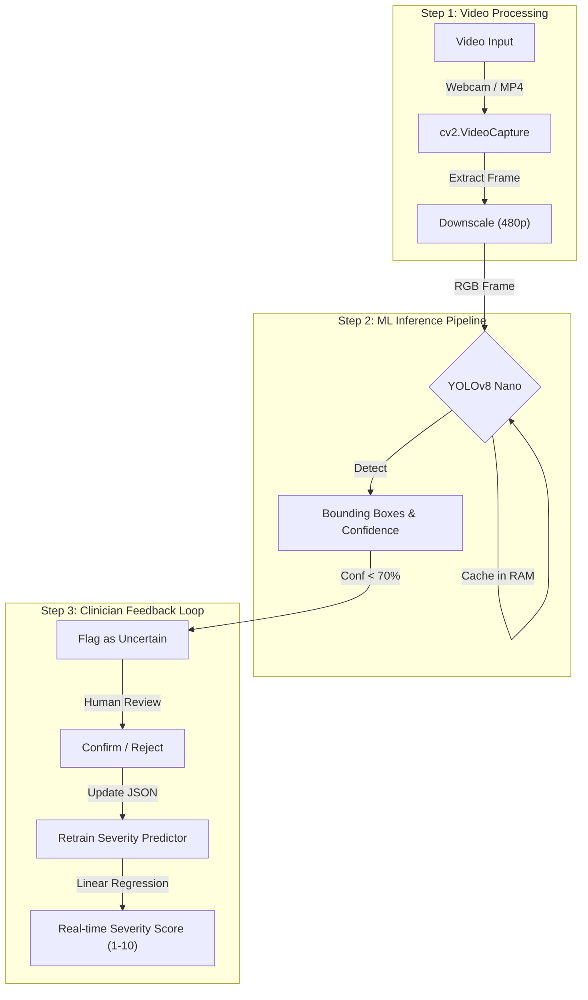

# 🔬 AI Polyp Detection Dashboard


An ultra-fast, production-ready computer vision application designed for real-time colonoscopy screening. Built completely in Python with **less than 200 lines of code**, it prioritizes a massive reduction in RAM usage and instantaneous startup times while offering a futuristic Glassmorphism user interface.

---

## 🔄 How It Works



---

## 🚀 Quick Start

```bash
git clone https://github.com/Deekshith06/Polyp-Detection-App.git
cd Polyp-Detection-App
python3 -m venv venv
source venv/bin/activate  # Windows: venv\Scripts\activate
pip install -r requirements.txt
python run.py
```

> ⚠️ **Note:** The `yolov8n.pt` model weights will automatically download on the first run.

---

## 📂 Project Structure

```
Polyp_Detection_App/
├── app.py                  # Main Application logic, video processing, & inference
├── styles.css              # Glassmorphism UI definitions
├── requirements.txt        # Minimal dependency list
├── yolov8n.pt              # Neural Network weights (auto-downloads)
└── data/
    ├── sample_colonoscopy.mp4 # Default simulation video feed
    └── user_corrections.json  # Locally persistent feedback storage
```

---

## 🔧 Tech Stack

| Component | Technology |
|-----------|------------|
| Frontend | Streamlit |
| Computer Vision | OpenCV (`opencv-python-headless`) |
| Object Detection | Ultralytics (YOLOv8 Nano) |
| Active Learning | Scikit-learn (Linear Regression) |

---

## 📊 Application Performance

| Metric | Value |
|--------|-------|
| Inference Latency | < 30 ms per frame |
| Startup Time | < 2 seconds |
| Codebase Size | < 200 lines (Single File Architecture) |
| Key Features | Auto-Adjusting Thresholds, Lazy Loading Imports |

---

## 👤 Author

**Seelaboyina Deekshith**

[](https://github.com/Deekshith06)
[](https://www.linkedin.com/in/deekshith030206)
[](mailto:seelaboyinadeekshith@gmail.com)

---

> ⭐ Star this repo if it helped you!
